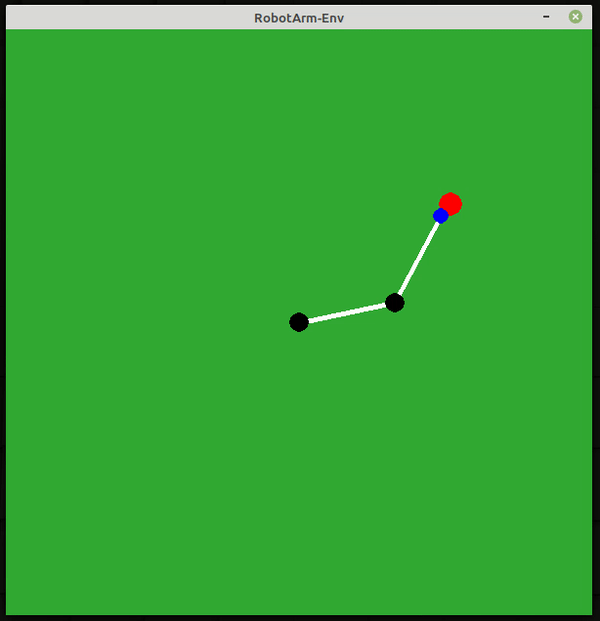

# OpenAI Gym 2D Robot Arm Environment

**Description**

This is a OpenAI gym environment for two links robot arm in 2D based on PyGame.



The robot consist of two links that each links has 100 pixels length, and the goal is reaching red point that generated randomly every episode. 

**RobotArm-V0**

Observation spaces (Continuous):

* target position in x direction (in pixels)
* target position in y direction (in pixels)
* current joint 1 position (in radians)
* current joint 2 position (in radians)

Action Spaces (Discrete):

* 0: Hold current joint angle value
* 1: Increment joint 1
* 2: Decrement joint 1
* 3: Increment joint 2
* 4: Decrement joint 2
* 5: Increment joint 1 and joint 2
* 6: Decrement joint 1 and joint 2

By default, increment or decrement rate for both of joints are 0.01 radians. 

Reward Function:

* Robot will get penalty -1 if current distance between tip and target position is smaller than previous distance
* Robot will get reward 1 if cureent distance between tip and target position is > -epsilon and < epsilon, where epsilon = 10 pixels

Terminal Condition:

* Current reward is -10 or +10

**RobotArm-V1**

Observation spaces (Continuous):

* target position in x direction (in pixels)
* target position in y direction (in pixels)
* current joint 1 position (in radians)
* current joint 2 position (in radians)

Action Spaces (Continuous):

* 0: joint 1 value (in range -1 to 1)
* 1: joint 2 value (in range -1 to 1)

value will be scaled into minimum and maximum of joint angle

Reward Function:

* reward = -distance_error / 100

Terminal Condition:

* if target position is > -epsilon and < epsilon, where epsilon = 5 pixels

**How To Install**

```bash
git clone https://github.com/ekorudiawan/gym-robot-arm.git
cd gym-robot-arm
pip install -e .
```

**Dependencies**
* OpenAI Gym
* PyGame
* Scipy

**Testing Environment**

```python
import gym 

env = gym.make('gym_robot_arm:robot-arm-v0')

for i_episode in range(20):
    observation = env.reset()
    for t in range(100):
        env.render()
        print(observation)
        action = env.action_space.sample()
        observation, reward, done, info = env.step(action)
        if done:
            print("Episode finished after {} timesteps".format(t+1))
            break
env.close()

```