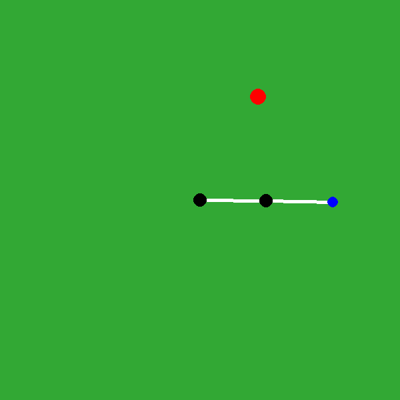
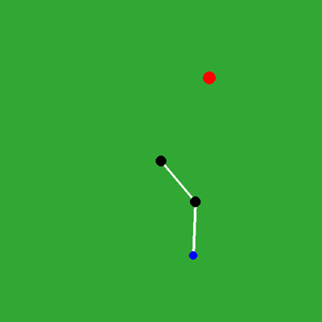

<p align="center">
  
  
</p>

<h1 align="center">🤖 Gym-Robot-Arm</h1>

<p align="center">
  <b>Gymnasium 2D Robot Arm Environment</b> — a two-link planar robotic arm reaching randomly generated targets.
</p>

<p align="center">
  <a href="https://pypi.org/project/gym-robot-arm/">
    
  </a>
  <a href="https://github.com/ekorudiawan/gym-robot-arm/actions">
    
  </a>
  <a href="./LICENSE">
    
  </a>
  <a href="https://gymnasium.farama.org/">
    
  </a>
</p>

---

## 🚀 Quick Start

```bash
pip install gym-robot-arm
```

Or from source:

```bash
git clone https://github.com/ekorudiawan/gym-robot-arm.git
cd gym-robot-arm
pip install -e .
```

## 🎮 Usage

### V0 — Discrete Actions

```python
import gymnasium as gym
import gym_robot_arm

env = gym.make("robot-arm-v0", render_mode="human")
obs, info = env.reset()

for _ in range(200):
    action = env.action_space.sample()          # 0–6
    obs, reward, terminated, truncated, info = env.step(action)
    env.render()
    if terminated or truncated:
        obs, info = env.reset()

env.close()
```

### V1 — Continuous Actions

```python
import gymnasium as gym
import gym_robot_arm
import numpy as np

env = gym.make("robot-arm-v1", render_mode="human")
obs, info = env.reset()

for _ in range(200):
    action = np.random.uniform(-1.0, 1.0, size=(2,)).astype(np.float32)
    obs, reward, terminated, truncated, info = env.step(action)
    env.render()
    if terminated or truncated:
        obs, info = env.reset()

env.close()
```

## 🧠 Environment Details

### Observation Space (both V0 & V1)

| Index | Field | Range | Units |
|-------|-------|-------|-------|
| 0 | Target X | [−200, 200] | pixels |
| 1 | Target Y | [−200, 200] | pixels |
| 2 | Joint 1 angle | [0, π/2] | radians |
| 3 | Joint 2 angle | [0, π/2] | radians |

### V0 — `robot-arm-v0`

| Property | Value |
|----------|-------|
| Action space | `Discrete(7)` — 7 discrete moves |
| Actions | Hold, Inc/Dec J1, Inc/Dec J2, Inc/Dec both |
| Inc rate | ~1° per step |
| Reward | +1 (within 10 px), −1 (away), 0 (closer) |
| Terminal | Score reaches ±10 |

### V1 — `robot-arm-v1`

| Property | Value |
|----------|-------|
| Action space | `Box(-1, 1, shape=(2,))` — continuous |
| Action mapping | Linearly scaled to [0°, 90°] per joint |
| Reward | `−distance / max_reach` (negative distance) |
| Terminal | Tip within 5 px of target |

## 📦 Dependencies

- **gymnasium** ≥ 0.28 — RL environment API
- **pygame** ≥ 2.0 — Rendering
- **numpy** ≥ 1.21 — Math

*(No scipy needed — replaced by numpy.)*

## 🔁 Changelog (v2.0)

| Change | Detail |
|--------|--------|
| **Gym → Gymnasium** | Full Gymnasium 1.x API (`terminated`, `truncated`, 5-value `step`) |
| **Registration** | Uses `gymnasium.register()`, import as `gym.make("robot-arm-v0")` |
| **No scipy** | Euclidean distance replaced with `np.linalg.norm` |
| **PyGame lifecycle** | Fixed `close()` properly quits pygame; no stale init |
| **Observation bounds** | Proper Box space instead of `np.finfo.min` |
| **Packaging** | `pyproject.toml` + `requirements.txt` |
| **CI** | GitHub Actions — Python 3.9–3.12 |
| **GIFs** | Auto-generated demo GIFs for both envs |

## 📄 License

MIT — see [LICENSE](./LICENSE).

---

<p align="center">
  Made by <a href="https://github.com/ekorudiawan">Eko Rudiawan Jamzuri</a>
</p>
